# Erlang 中文手冊

以下全文翻譯自 [Jetbrains](https://www.jetbrains.com/help/idea/getting-started-with-erlang.html#d207953e18)

[Erlang](http://www.erlang.org/) 是一個支持高平行化(高併發)的程式語言, 參考以下步驟來上手. 部分連結失效可能是尚在翻譯中.

## 章節目錄：

*   [前置步驟](#d252311e12)
    *   [安裝Erlang OTP](#d252311e14)
        *   [Windows](#d252311e19)
        *   [macOS](#d252311e31)
        *   [Linux](#d252311e52)
    *   [驗證安裝](#d252311e78)
    *   [安裝Rebar](#d252311e95)
*   [設定IntelliJ IDEA開發IDE](#d252311e111)
    *   [設定Erlang SDK](#d252311e139)
    *   [設定Rebar](#d252311e202)
*   [建立一個新專案](#d252311e218)
    *   [建立一個Erlang專案](#d252311e220)
    *   [建立一個Rebar專案](#d252311e258)
    *   [匯入既有專案到IntelliJ IDEA](#import)
*   [執行與偵錯你的應用](#d252311e306)
*   [執行Eunit單元測試](#d252311e362)
*   [執行Rebar命令列](#d252311e384)

前置步驟
-----------------

### Installing Erlang OTP

第一件事情就是安裝Erlang OTP, 相當於安裝libc這種標準函式庫.

#### Windows

Windows用戶請下載 [Erlang OTP package](http://www.erlang.org/download.html) 並執行安裝精靈. 安裝結束後打開電腦的環境變數設定, 將OTP的安裝路徑`\bin` 添加到你的PATH 環境變數.

#### macOS

如果是macOS用戶, 現在可以更簡易的透過brew安裝 erlang. 如果你還沒有安裝過brew, 請先到 [Homebrew](http://brew.sh/) 下載並安裝, 之後就可以打:

```
brew install erlang
```

### Ubuntu/Debian
如果是Debian系列的可以用apt-get安裝.

```
apt-get install erlang
```

### CentOS/RHEL-based
如果是CentOS系列的預設沒有erlang, 可以先安裝epel-release. 不過這也表示你打算在開發階段就用vim, 筆者也是佩服得緊阿.

```
sudo yum -y install epel-release
yum -y install erlang
```

### 驗證安裝

命令列輸入
```
erl
```

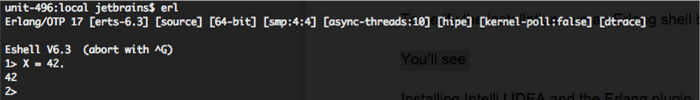

要了解更多Erlang shell [user guide](http://www.erlang.org/doc/getting_started/seq_prog.html#id60113).

### 安裝 Rebar

除了Erlang OTP, 你還需要 [Rebar](http://www.erlang.org/doc/getting_started/seq_prog.html#id60113), 一款編譯工具幫助你把.erl 檔案編譯成binary, 並且包含測試工具. 你可以下載source code編譯後安裝到自己本地:

```
git clone git://github.com/rebar/rebar.git
$ cd rebar
$ ./bootstrap
Recompile: src/getopt
...
Recompile: src/rebar_utils
==> rebar (compile)
```

恭喜你已經在下載source code的目錄編譯出了一個腳本型rebar命令工具. 建議安裝到
`/usr/local/bin` 就可以直接輸入`rebar`來使用

設定IntelliJ IDEA開發IDE
------------------------

下載IntelliJ IDEA [download](https://www.jetbrains.com/idea/download/) and [install](install-and-set-up-product.html). 你可以免費使用社群版本進行開發.

設定好了之後你會看到 [歡迎畫面](welcome-screen.html), 到設定Configure | 插件Plugins, 選瀏覽 repositories, 找到Erlang插件並安裝:

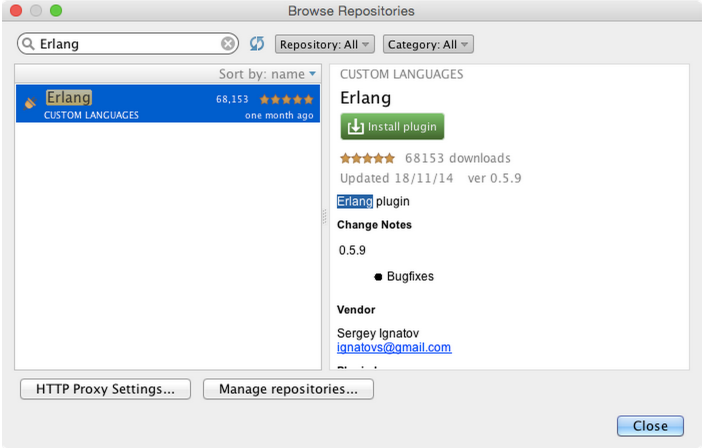

安裝之後重新啟動 IntelliJ IDEA.

### 設定Erlang SDK

你需要特別設定告訴IntelliJ IDEA使用哪一版本的Erlang SDK(架設你可能安裝多個版本)
修改預設專案的結構, 用以下任一方法修改預設專案：

*   在 [歡迎畫面](welcome-screen.html), 到 Configure | Project Defaults | Project Structure
*   在上方 menu, 選 File | Other Settings | Default Project Structure

將你安裝的Erlang OTP路徑設定給Erlang SDK.

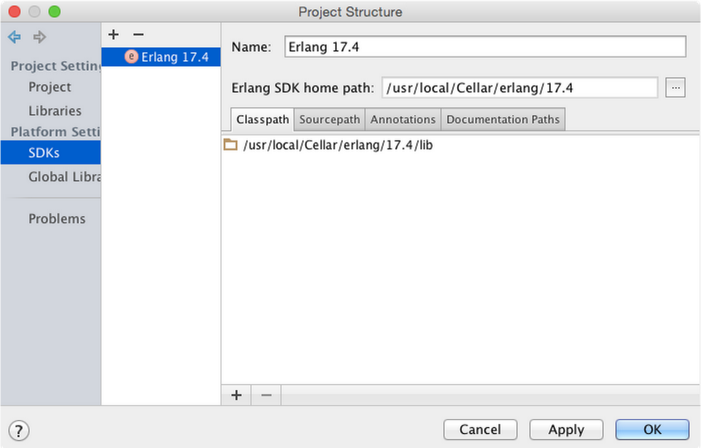

通常安裝路徑都在這：
*   Windows: `C:\Program Files\erl<version>`
*   Linux: `/usr/lib/erlang/<version>`
*   MacPorts, macOS: `/opt/local/lib/erlang/<version>`
*   Homebrew, macOS: `/usr/local/Cellar/erlang/<version>`

### 設定 Rebar

最後就是調整你的rebar路徑, 讓 IntelliJ IDEA可以直接在IDE內執行rebar

到 Configure | Preferences | 其他設定 Other Settings → Erlang External Tools:

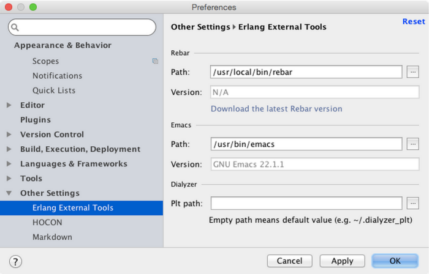

建立一個新專案
----------------------

### 建立你的第一個 Erlang project

最簡單的是透過歡迎畫面上的 [新專案精靈](new-project-wizard.html) 

選 Create New Project:

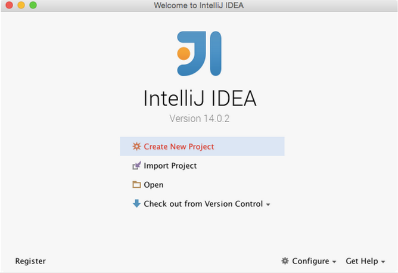

從左方區域選 Erlang > Next.

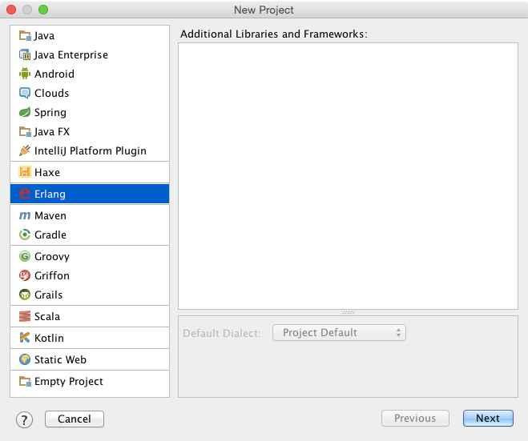

選先前步驟設定好的 Erlang SDK:

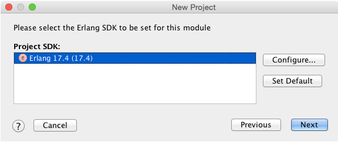

詢問時設定專案名稱. 依照下圖假設設定為 `ErlangDemo`:

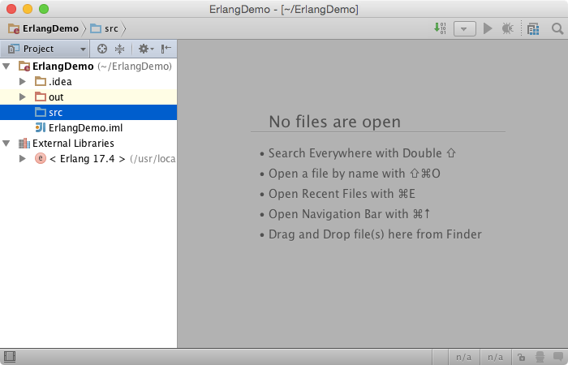

### 建立一個 Rebar 專案

除了Erlang專案你還可以建立 [Rebar](https://github.com/rebar/rebar) 專案. 從命令列輸入:

`rebar create-app appid=<project name>`

建立好了之後再透過匯入到 [import](#import) IntelliJ IDEA.

### 匯入既有專案到 IntelliJ IDEA

你可以從歡迎畫面匯入專案.選Import>選專案目錄. 你可以從既有的專案匯入或是從build file.

如果你的專案使用Rebar, 選擇以下選項.

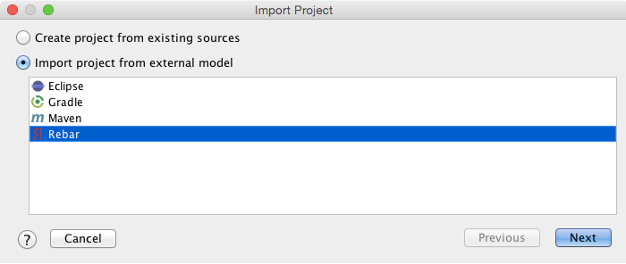

當匯入Rebar專案時記得勾選啟用自動下載相依套件:

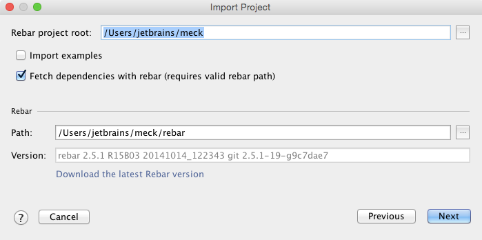

執行與偵錯你的應用
------------------------------------

要執行應用, 你需要建立一個執行組態 [create a run/debug configuration](creating-and-editing-run-debug-configurations.html) 在主要menu選擇 Run | Edit Configurations, 選擇stub Erlang Application, 指定名稱, 例如`hello.hello_world`, 並指定應用的模組和函式作為一個入口(entry point):

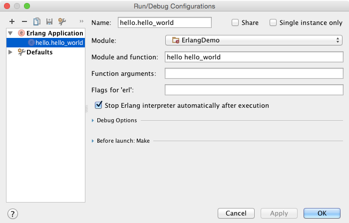

之後你就可以在主目錄選 (Run | Run <run configuration name>, the toolbar (), 或是快速鍵 (⌃⇧R).

當你有一個執行組態, 你可以選 Debug 執行組態 (Run | Debug ‘<run configuration name>, the toolbar (), 或是快速鍵 (⌃D):

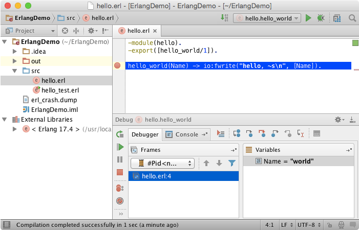

執行Eunit單元測試
-------------------

執行Eunit單元測試跟執行整個應用類似, 但是需要另外的執行組態, 建立一個 stub Erlang Eunit:

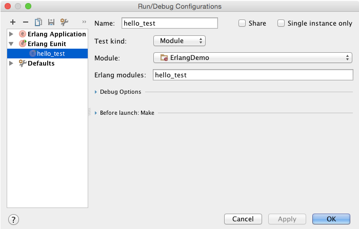

IntelliJ IDEA 提供一個方便的 [Test Runner](test-runner-tab.html) 來檢閱執行的結果 [Eunit](http://www.erlang.org/doc/apps/eunit/chapter.html). 可以讓你快速跳到錯誤的地方:

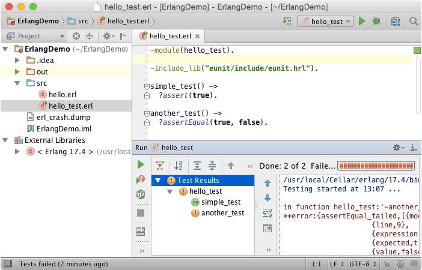

執行Rebar命令列
----------------------

可以直接從IDE透過執行組態執行rebar命令:

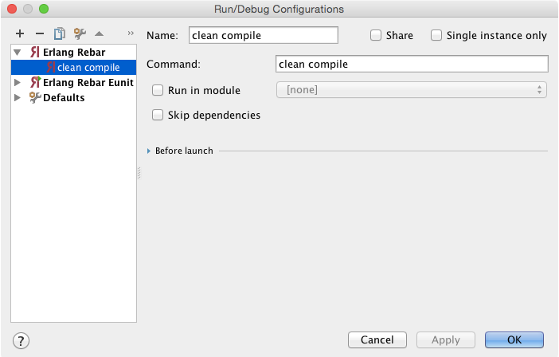

如果你用Rebar命令列來執行eunit, 你可以用eunit執行組態來看結果.


## References

https://www.jetbrains.com/help/idea/getting-started-with-erlang.html#d207953e18